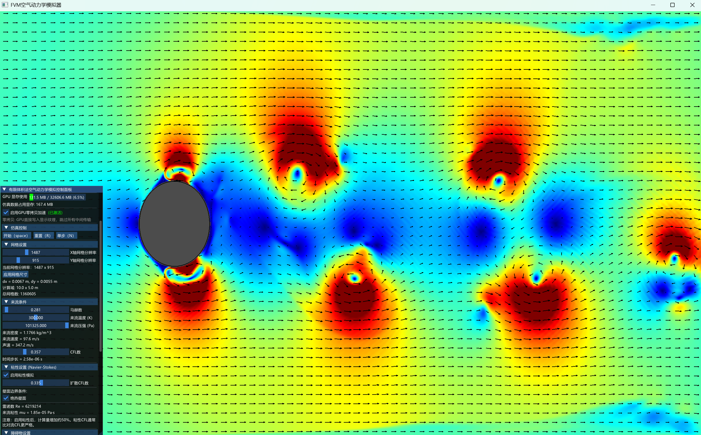
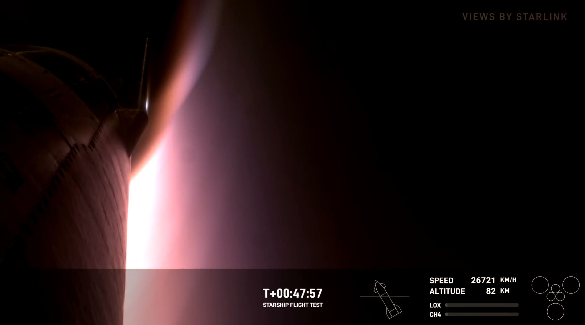

# FVM-Aerodynamic-Simulator

## 项目概述

本项目是一个受 SpaceX星舰项目启发（传奇耐烧王S29），开发的**实时交互式**的高速空气动力学仿真器，采用**有限体积法（FVM）**求解可压缩 Navier-Stokes 方程组，实现对超音速/高超音速流场的精确模拟，以预测物体在流体中运动时产生的空气动力学现象，

本项目可以在低风速（0.3Mach）左右或高风速（大于3Mach）下获得符合流体力学理论的现象：

- 低风速下：[卡门涡街](https://zh.wikipedia.org/wiki/%E5%8D%A1%E9%97%A8%E6%B6%A1%E8%A1%97)：




- 高超音速下：[弓形激波](https://en.wikipedia.org/wiki/Bow_shock_(aerodynamics))，[粘性尾流](https://baike.baidu.com/item/%E9%AB%98%E8%B6%85%E5%A3%B0%E9%80%9F%E5%B0%BE%E8%BF%B9/12619692)等：





支持更复杂的障碍物：


## 主要难点
- **GPU 全加速**：CUDA 计算 + OpenGL 渲染，实现端到端的 GPU 流水线
- **零拷贝互操作**：CUDA-OpenGL 双缓冲 PBO 技术，避免 CPU 瓶颈
- **实时交互**：ImGui 控制面板，实时调整参数并观察结果
- **多样可视化**：支持温度、压强、密度、速度、马赫数场，配备 5 种 colormap
- **速度矢量场**：可调密度的箭头可视化，清晰展示流动方向

---

## 核心特性

### 物理求解器
- **可压缩 Euler 方程**：完整求解质量、动量、能量守恒方程
- **粘性扩展**：支持 Navier-Stokes 方程（可选粘性项）
- **Sutherland 粘性模型**：精确计算温度相关的动力粘性系数
- **CFL 自适应时间步**：自动调整时间步长，确保数值稳定性
- **浸入边界法**：支持复杂障碍物形状（圆形、星形、菱形、胶囊形、三角形）

### 边界条件
- **入流边界**：固定超音速来流条件
- **出流边界**：基于Riemann不变量构造的NRBC（无反射边界条件）
- **固体壁面**：滑移壁面（无粘）/ 无滑移壁面（粘性）
- **热边界条件**：绝热壁面 / 等温壁面（可选）

### 可视化功能
- **多物理场显示**：温度 / 压强 / 密度 / 速度幅值 / 马赫数
- **5 种 Colormap**：Jet / Hot / Plasma / Inferno / Viridis
- **速度矢量箭头**：可调密度，黑色箭头清晰可见
- **障碍物轮廓**：半透明白色边界线，支持旋转
- **网格参数可视化**：实时显示网格分辨率

### CUDA-OpenGL 互操作
- **双缓冲 PBO**：异步流水线，CUDA 写入与 OpenGL 读取并行
-  **零拷贝传输**：数据全程在 GPU 内部流转，无 CPU 往返。

---

## 技术架构

```
┌──────────────────────────────────────────────────────────────┐
│                         用户交互层                            
│  ImGui UI (参数调整、可视化控制、性能监控)                    
└──────────────────────────────────────────────────────────────┘
                            ↕
┌──────────────────────────────────────────────────────────────┐
│                        渲染层 (OpenGL)                        
│  • 纹理映射 (物理场数据)                                       
│  • 片段着色器 (Colormap 查找)                                  
│  • 矢量箭头渲染 (速度场)                                       
│  • 障碍物轮廓线                                                
└──────────────────────────────────────────────────────────────┘
                            ↕
┌──────────────────────────────────────────────────────────────┐
│                   CUDA-OpenGL 互操作层                        
│  • 双缓冲 PBO (Pixel Buffer Object)                           
│  • cudaGraphicsMapResources / UnmapResources                 
│  • 零拷贝 GPU→GPU 数据传输                                    
└──────────────────────────────────────────────────────────────┘
                            ↕
┌──────────────────────────────────────────────────────────────┐
│                      计算层 (CUDA Kernels)                    
│  • 初始化场 (initFieldsKernel)                                
│  • 识别障碍物 (markObstacleKernel)                           
│  • 计算通量 (computeFluxKernel_AUSM_Plus)                     
│  • 更新场 (updateFieldKernel)                                 
│  • 边界条件 (applyBoundaryConditionsKernel)                  
│  • 粘性项 (computeViscousFluxKernel)                          
│  • 颜色映射 (fillTextureKernel)                               
└──────────────────────────────────────────────────────────────┘
                            ↕
┌──────────────────────────────────────────────────────────────┐
│                        数据存储层                             
│  • 设备内存 (d_rho, d_rho_u, d_rho_v, d_E, d_cellTypes)     
│  • 主机缓冲区 (h_temperature, h_pressure, h_u, h_v)         
└──────────────────────────────────────────────────────────────┘
```

### 数据流图（互操作模式）

```
┌─────────────┐
│ CUDA Kernel │ 计算物理场
└──────┬──────┘
       │ 写入
       ↓
┌─────────────┐
│   PBO_A     │ ←─┐
└──────┬──────┘   │
       │          │ 双缓冲交替
       ↓          │
┌─────────────┐   │
│   Texture   │ ──┤
└──────┬──────┘   │
       │          │
       ↓          │
┌─────────────┐   │
│   Render    │   │
└─────────────┘   │
                  │
┌─────────────┐   │
│   PBO_B     │ ──┘
└─────────────┘
   ↑ 写入
   │
┌──────────────┐
│ CUDA Kernel  │ (下一帧)
└──────────────┘
```

---

## 系统要求

### 硬件要求
- **GPU**：NVIDIA 显卡，计算能力 ≥ 7.5（RTX 20 系列及以上）
  - 推荐：RTX 3060 / RTX 4060 或更高

### 软件要求
- **操作系统**：Windows 10/11 (x64)
- **CUDA Toolkit**：12.0 或更高版本
- **编译器**：Visual Studio 2022（MSVC 17.0+）
- **CMake**：3.21 或更高版本
- **vcpkg**：包管理器（用于安装依赖）
- **显卡驱动**：支持 CUDA 12.0+ 的最新驱动

---

## 构建指南

### 步骤 1：安装 CUDA Toolkit

从 [NVIDIA 官网](https://developer.nvidia.com/cuda-downloads) 下载并安装 CUDA Toolkit。

**推荐版本**：CUDA 12.0 或更高版本

安装后，CMake 会**自动检测**系统中的 CUDA 安装，无需手动配置路径。

验证安装：
```powershell
nvcc --version
```

### 步骤 2：安装 vcpkg

vcpkg 是 C++ 包管理器，用于安装项目依赖（GLFW、GLAD）。

```powershell
# 克隆 vcpkg（选择合适的安装位置）
git clone https://github.com/microsoft/vcpkg.git C:\vcpkg
cd C:\vcpkg

# 引导安装
.\bootstrap-vcpkg.bat

# 设置环境变量（可选，但推荐）
# 在系统环境变量中添加：VCPKG_ROOT = C:\vcpkg
[Environment]::SetEnvironmentVariable("VCPKG_ROOT", "C:\vcpkg", "User")
```

安装项目依赖：
```powershell
.\vcpkg install glfw3:x64-windows glad:x64-windows
```

**注意**：CMake 会自动检测以下位置的 vcpkg：
- 环境变量 `VCPKG_ROOT` 指定的路径
- `D:\vcpkg`
- `C:\vcpkg`
- 项目根目录下的 `vcpkg/`

如果 vcpkg 安装在其他位置，需要在配置时指定：
```powershell
cmake -B build -DCMAKE_TOOLCHAIN_FILE="你的路径/vcpkg/scripts/buildsystems/vcpkg.cmake"
```

### 步骤 3：克隆项目

```powershell
git clone <your-repo-url> D:\Project\FVM-Aerodynamic-Simulator
cd D:\Project\FVM-Aerodynamic-Simulator
```

### 步骤 4：配置和构建

#### 方式 1：使用 CMake 命令行（推荐）

```powershell
# 配置项目（首次构建）
cmake -B build -G "Visual Studio 17 2022" -A x64

# 编译 Release 版本
cmake --build build --config Release -j

# （可选）安装到 dist 目录
cmake --install build --config Release
```

**配置输出说明**：
- CMake 会显示详细的检测信息，包括：
  - vcpkg 工具链路径
  - CUDA 版本和安装位置
  - 找到的依赖库版本
  - 源文件数量
  - 编译选项和链接配置

如果配置失败，请检查输出中的错误信息：
- `✗` 表示未找到的依赖
- `⚠` 表示警告信息

#### 方式 2：使用 Visual Studio

1. 用 Visual Studio 2022 打开项目文件夹
2. CMake 会自动配置（查看"输出"窗口）
3. 选择 `生成` → `全部生成`
4. 可执行文件位于 `build\Release\`

#### 方式 3：使用 VS Code + CMake 扩展

1. 安装扩展：`CMake Tools`
2. 打开项目文件夹
3. 按 `Ctrl+Shift+P`，选择 `CMake: Configure`
4. 按 `F7` 或选择 `CMake: Build`

### 步骤 5：运行程序

```powershell
# 进入构建目录
cd build\Release

# 运行程序
.\FVM-Aerodynamic-Simulator.exe
```

或者运行安装后的版本：
```powershell
cd dist
.\FVM-Aerodynamic-Simulator.exe
```

### 常见问题排查

#### 1. CMake 找不到 CUDA

**症状**：`CUDA Toolkit 未找到`

**解决方法**：
- 确认 CUDA Toolkit 已正确安装
- 检查环境变量 `PATH` 中是否包含 CUDA 的 `bin` 目录
- 手动指定 CUDA 路径：
  ```powershell
  cmake -B build -DCUDAToolkit_ROOT="C:/Program Files/NVIDIA GPU Computing Toolkit/CUDA/v12.6"
  ```

#### 2. CMake 找不到 vcpkg

**症状**：`未找到 vcpkg 工具链`

**解决方法**：
- 设置环境变量 `VCPKG_ROOT`
- 或使用 `-DCMAKE_TOOLCHAIN_FILE` 手动指定

#### 3. 编译时 CUDA 架构错误

**症状**：`unsupported gpu architecture 'compute_XX'`

**解决方法**：

- 修改 `CMakeLists.txt` 中的 `CMAKE_CUDA_ARCHITECTURES`
- 或在配置时指定：
  ```powershell
  cmake -B build -DCMAKE_CUDA_ARCHITECTURES="86"  # 仅编译 RTX 30 系列
  ```

#### 4. 运行时缺少 DLL

**症状**：程序启动失败，提示缺少 `.dll` 文件

**解决方法**：
- 重新构建，CMake 会自动复制所需的 DLL
- 或手动从 `vcpkg/installed/x64-windows/bin/` 复制 DLL 到可执行文件目录

### 高级配置选项

```powershell
# 指定 CUDA 架构（仅编译特定 GPU）
cmake -B build -DCMAKE_CUDA_ARCHITECTURES="89"  # 仅 RTX 40 系列

# 启用详细构建输出
cmake -B build -DCMAKE_VERBOSE_MAKEFILE=ON

# 使用 Ninja 构建系统（更快）
cmake -B build -G Ninja
cmake --build build --config Release

# 并行编译（使用 8 个线程）
cmake --build build --config Release -j8
```

---

## 使用说明

### 启动程序
- **主渲染窗口**：显示流场的伪彩色图
- **控制面板**：左侧 ImGui 界面

- **Colormap**：
  - Jet（蓝-青-绿-黄-红）
  - Hot（黑-红-黄-白）
  - Plasma（深紫-红紫-橙-黄）
  - Inferno（黑-深红-橙-黄白）
  - Viridis（深紫-蓝绿-绿黄）

- **仿真耗时**：每步计算时间（毫秒）

### 快捷键
| 快捷键  | 功能          |
| ------- | ------------- |
| `Space` | 开始/暂停仿真 |
| `R`     | 重置仿真      |
| `S`     | 单步执行      |
| `Esc`   | 退出程序      |

---

## 物理模型

如果您希望详细理解，请阅读[项目物理原理规划.md](docs/项目物理原理规划.md)或[求解器实现日志.md](docs/求解器实现日志.md)。
以下是宏观的概述，对于不了解相关物理知识的读者而言无法提供足够的帮助。

### 控制方程组

**可压缩 Navier-Stokes 方程**（守恒形式）：

$$
\frac{\partial \mathbf{U}}{\partial t} + \frac{\partial \mathbf{F}}{\partial x} + \frac{\partial \mathbf{G}}{\partial y} = \frac{\partial \mathbf{F}_v}{\partial x} + \frac{\partial \mathbf{G}_v}{\partial y}
$$

**守恒变量**：

$$
\mathbf{U} = \begin{bmatrix} \rho \\\\ \rho u \\\\ \rho v \\\\ E \end{bmatrix}
$$

**对流通量**（AUSM+ 格式）：

$$
\mathbf{F} = \begin{bmatrix} \rho u \\\\ \rho u^2 + p \\\\ \rho uv \\\\ (E+p)u \end{bmatrix}, \quad
\mathbf{G} = \begin{bmatrix} \rho v \\\\ \rho uv \\\\ \rho v^2 + p \\\\ (E+p)v \end{bmatrix}
$$

**粘性通量**（中心差分）：

$$
\mathbf{F}_v = \begin{bmatrix} 0 \\\\ \tau_{xx} \\\\ \tau_{xy} \\\\ u\tau_{xx} + v\tau_{xy} - q_x \end{bmatrix}, \quad
\mathbf{G}_v = \begin{bmatrix} 0 \\\\ \tau_{xy} \\\\ \tau_{yy} \\\\ u\tau_{xy} + v\tau_{yy} - q_y \end{bmatrix}
$$

### 本构关系

**理想气体状态方程**：

$$
p = \rho R T = (\gamma - 1)\left(E - \frac{1}{2}\rho(u^2 + v^2)\right)
$$

**Sutherland 粘性公式**：

$$
\mu(T) = \mu_{ref} \left(\frac{T}{T_{ref}}\right)^{3/2} \frac{T_{ref} + S}{T + S}
$$

其中：$\mu_{ref} = 1.716 \times 10^{-5}$ Pa·s，$T_{ref} = 273.15$ K，$S = 110.4$ K

**热导率**（Prandtl 数关系）：

$$
k = \frac{\mu C_p}{Pr}, \quad Pr = 0.71
$$

### 数值方法

**时间积分**：TVD Runge-Kutta 2阶

$$
\begin{aligned}
\mathbf{U}^* &= \mathbf{U}^n + \Delta t \mathcal{L}(\mathbf{U}^n) \\\\
\mathbf{U}^{n+1} &= \frac{1}{2}\mathbf{U}^n + \frac{1}{2}\left[\mathbf{U}^* + \Delta t \mathcal{L}(\mathbf{U}^*)\right]
\end{aligned}
$$

**CFL 条件**：

$$
\Delta t = \text{CFL} \times \min\left(\frac{\Delta x}{|u| + c}, \frac{\Delta y}{|v| + c}, \frac{\Delta x^2}{\nu}, \frac{\Delta y^2}{\nu}\right)
$$

---

## 项目结构

```
FVM-Aerodynamic-Simulator/
├── img/                      # 图片文件
├── assets/                      # 资源文件
│   ├── fonts/                   # 字体文件
│   │   └── msyh.ttc            # 微软雅黑
│   └── shaders/                 # 着色器（未使用，代码内嵌）
├── build/                       # CMake 构建输出
│   └── Release/                 # Release 可执行文件
├── docs/                        # 项目文档
│   ├── 求解器实现日志.md        # 开发日志
│   └── 项目物理原理规划.md      # 物理模型说明
├── external/                    # 第三方库
│   └── imgui/                   # ImGui GUI 库
├── src/                         # 源代码
│   ├── include/                 # 头文件
│   │   ├── common.h            # 公共定义（常数、结构体、枚举）
│   │   ├── renderer.h          # 渲染器类定义
│   │   └── solver.cuh          # CUDA 求解器类定义
│   ├── main.cpp                # 主程序入口
│   ├── renderer.cpp            # OpenGL 渲染器实现
│   └── solver.cu               # CUDA 求解器实现
├── .gitignore                   # Git 忽略文件
├── CMakeLists.txt              # CMake 构建脚本
└── README.md                   # 项目说明文档
```

## 致谢

本项目使用了以下优秀的开源库：
- [CUDA Toolkit](https://developer.nvidia.com/cuda-toolkit) - NVIDIA GPU 计算平台
- [OpenGL](https://www.opengl.org/) - 跨平台图形 API
- [GLFW](https://www.glfw.org/) - OpenGL 窗口与上下文管理
- [GLAD](https://glad.dav1d.de/) - OpenGL 扩展加载器
- [Dear ImGui](https://github.com/ocornut/imgui) - 即时模式 GUI 库
- [vcpkg](https://github.com/microsoft/vcpkg) - C++ 包管理器

感谢所有贡献者和开源社区！

<div align="center">
**⭐ 如果这个项目对你有帮助，请给个 Star！⭐**

</div>
